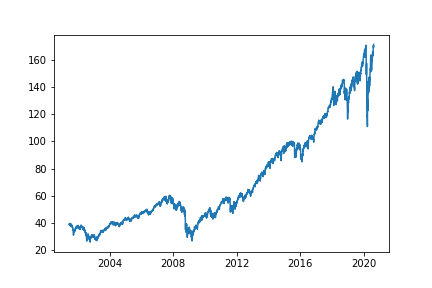
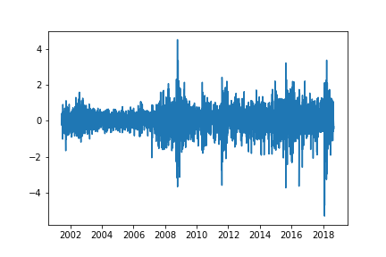
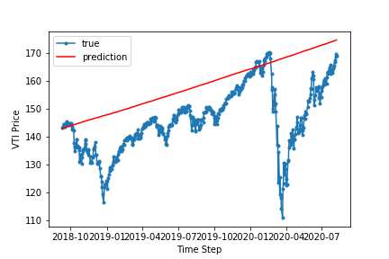
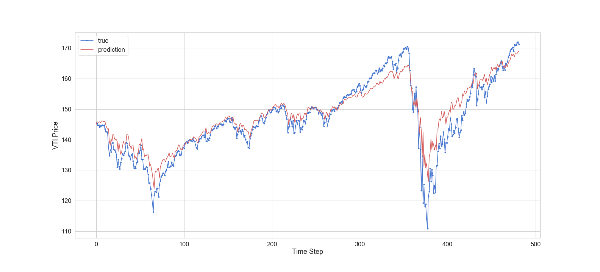
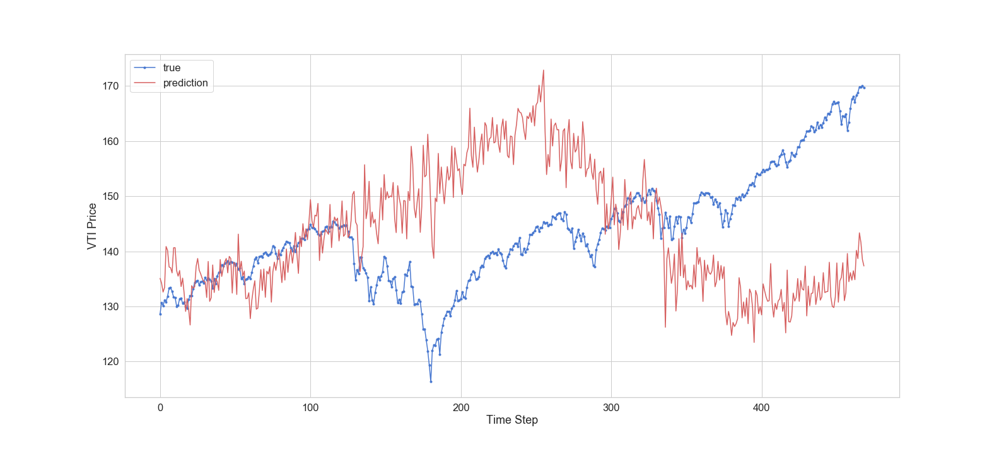

# Predicting the Price of Exchange Traded Funds With LSTM Using TensorFlow and Keras

## <em>Predicting Associated Change Over Time</em>

So many interesting metrics in life are predicated on their history. To tell the truth, I don't find stocks to be nearly as interesting as topics like people's interest over time, preferences over time, and general behavioral change over time. However, an accessible public stream of this data is not easy to find (if it's even possible). Knowing that methods are largely the same regardless of the data, I decided to use stock data, specifically an ETF (VTI) which is an amalgamation of multiple holdings.

That is all to say, my goal is not at all to get rich off of this project, but I do hope that I can at least utilize Long Short Term Memory and Recurrent Neural Networks well enough to do better than a very basic model, and be able to transfer my knowledge to other topics in the future.

# Data Sourcing:

Our target EFT will be VTI. To source the data history of VTI we use the [yfinance library](https://pypi.org/project/yfinance/) (thank you [Ran Aroussi!!!](https://pypi.org/user/ranaroussi/))

This is the only data needed for our ARIMA model, however to supplement it for our LSTM model we also use yfinance to collect the histories for the top 10 holdings of our ETF, as well as the DOW.

Also to supplement our LSTM model we use the monthly average of searches for 'vti' on google using google trends. This data is pulled through the [pytrends library](https://pypi.org/project/pytrends/) (thank you John Hogue!)

# Data Cleaning, Feature Selection, and Feature Engineering:

Our target data has a clear upward trend.

In order to deal with this for our ARIMA model we will difference it once. This produces a dataset that has a constant mean.

For our LSTM model, there is more work to do though because there are more features to deal with.

#### Google Trends

First, the Google trend data needs to be engineered a bit.

Because the data is monthly we need to upsample it to be daily. In most cases the last value will be incomplete (unless you happen to pull it on the last day of the month). Thus, we grab the value of the last full month in order to use it in place of the current month later.

Next it's best to skip down to the VTI and Holdings section, and once that's complete come back here and we will join our trends data to our main data frame.

We can't concatenate the google trend data to our dataframe like we had the other series though, because this data includes weekends. To get around that, we use a left join from our df, thus it only joins the days that our dataframe has indexes for.

After it's joined we'll have NaN's for any day past the first of this month, as well as all days before google existed. For the days in this month we'll fill them with the amount from last month. For the dates before information was taken we'll fill them with the average amount of searches.

#### VTI and Holdings

Preparing the VTI and top 10 holding data is fairly straightforward. First we can simply concatenate the 'Close' series from each data frame together using an outer join. Because they all have identical time series indexes they will line up with each other nicely.

Because we only care about the data related to our target we can truncate the dataframe to start when that data starts ('June 15th, 2001')

After doing that you can continue with the last bit of google trends cleaning above, and the DOW below, then come back here.

Lastly, because some stocks are younger than VTI, we'll fill the NaN's at their beginning with each stock's lowest value.

#### DOW

If this information is pulled during the day, the dow may not have been reported yet and thus will be NaN. If this is the case, we fill it with the previous day's value.

### Scaling

In order to use an LSTM model in keras you must scale your data. Because it's important to include as much of the information as possible I used a MinMaxScaler as opposed to a RobustScaler, and because the distribution of values isn't normal we couldn't use a StandardScaler.

# Modeling

### ARIMA

In order to use our ARIMA model as a baseline to test our LSTM model against we split the data in the same way, using 90% as training and the last 10% as testing. After being trained our model's predictions achieve a Mean Absolute Error of 12.68. Visually, it is very clear that our ARIMA model was not able to deal with the effects of COVID-19

### LSTM 90 training / 10 testing split

Our LSTM model did substantially better though, achieving a root mean squared error of 4.52 and a mean absolute error of 3.21. Viewing the difference between these two results says a lot:

It's clear that the LSTM model picks up much more of the changes to the price when the pandemic caused it to fluctuate wildly.

To see how this would work as an investment strategy I created a function to turn the predictions into binary values showing either whether the next day's price would be higher or lower, and then created a function to invest or sell based on the predictions. Despite picking up on trends, it would not be a successful investment strategy, garnering only $848.18, whereas just buying and holding over the same period of time would leave you with shares worth $1,177.40.

### LSTM Rolling Predictions

In practice, what we would want to do is train using all data up through today, and then predict the price for tomorrow. To see how this would compare with our benchmark and our split LSTM model.

To emulate the process of making predictions over this time, we created a loop that iterates through the time period and constantly trained a new model based on the new history.

The results of this method were less accurate than one would think. We got an RMSE of 31.13 and an MAE of 26.19. Our graph shows how inconsistent the predictions were.

Using this as an investment strategy, however, was even more surprising. Despite having poor evaluation metrics, investing based on these predictions would leave us with $1361.85, as opposed to the $1191.09

(note, fluxuation in the price of VTI between running these models changed what the ending value would be.)

# Conclusion:

The black box model is certainly a black box. With the amount of noise we can see though this may not be a model we would want to bet on.

In the future, I would like to:

<ul>
<li>Test the rolling model over periods with different price patterns</li>
<li>Experiment with increasing the frequency of collecting stocks to compare mid-day trends rather than end of day. This was not possible with this API, but building something to collect the information is within reason.</li>
<li>Create a user-friendly frontend so someone could run this model from a website just by knowing an ETF and it's top 10 holdings</li>
</ul>
